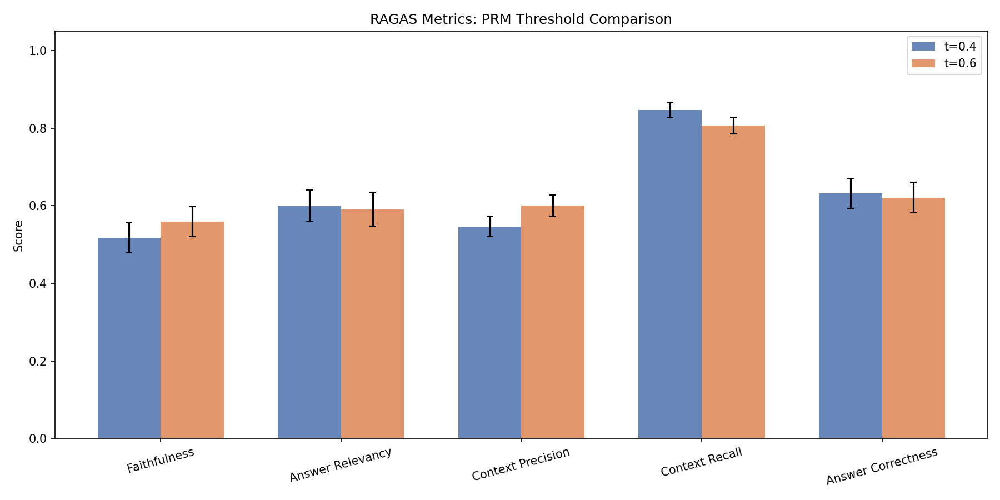
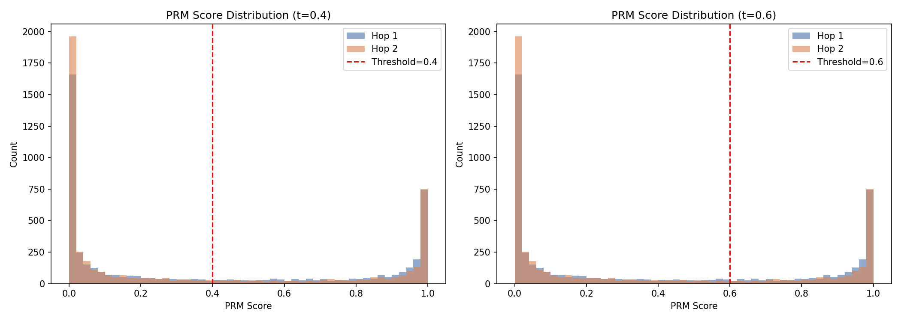
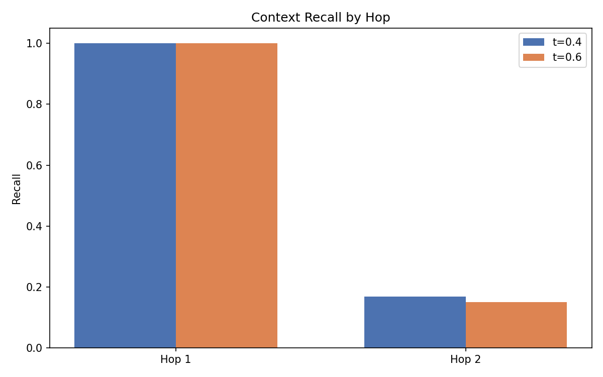

# Process Reward Model for Multi-Hop QA (HotpotQA Distractor Setting)

**AIMS-DTU Research Intern Round 2**

A Process Reward Model (PRM) that acts as a scoring gate at every retrieval step in a multi-hop RAG pipeline, evaluated on the HotpotQA distractor benchmark with RAGAS metrics.

## Overview

Standard RAG pipelines retrieve documents and dump everything into the LLM. Not everything retrieved is relevant - some paragraphs are noise, some are misleading. A PRM fixes this by scoring each retrieved paragraph at every hop and deciding whether it deserves to stay in the context.

### Multi-Hop Retrieval

Some questions require a chain of reasoning across multiple documents:

> "What nationality is the director of the film Parasite?"

- **Hop 1:** Retrieve paragraph about *Parasite* -> find director: Bong Joon-ho
- **Hop 2:** Use "Bong Joon-ho" as bridge entity -> retrieve his Wikipedia paragraph -> find: South Korean

### HotpotQA Distractor Setting

Each question comes with **10 paragraphs**: 2 gold (supporting facts) + 8 distractors. The PRM must consistently score the 2 gold paragraphs above the 8 distractors.

## Tech Stack

| Component | Model | Notes |
|---|---|---|
| Embeddings | `sentence-transformers/all-MiniLM-L6-v2` | 384-dim, free |
| PRM Scorer | `cross-encoder/ms-marco-MiniLM-L-6-v2` | Zero-shot, ~22M params |
| Vector Search | FAISS (`IndexFlatIP`) | Cosine similarity (L2-normalized) |
| Answer Generator | `google/flan-t5-large` | CPU-compatible |
| RAGAS Judge | Ollama `mistral:7b` | Free, local |
| Dataset | HotpotQA distractor split | 500 validation questions |

**No API keys required. All models run locally.**

## Setup

```bash
# Clone and install
git clone https://github.com/RishiiGamer2201/prm-hotpotqa
cd prm-hotpotqa
pip install -r requirements.txt
python -m spacy download en_core_web_sm

# Install Ollama for RAGAS evaluation (one-time)
# Linux/Mac:
curl -fsSL https://ollama.com/install.sh | sh
# Windows: Download from https://ollama.com/download

# Pull the model
ollama pull mistral
```

## Reproduce Pipeline

```bash
# Run full pipeline for both thresholds
python src/pipeline.py --threshold 0.4 --output results/t0.4_raw.jsonl
python src/pipeline.py --threshold 0.6 --output results/t0.6_raw.jsonl
```

## Run Evaluation

```bash
# Start Ollama in a separate terminal
ollama serve

# Run RAGAS evaluation
python eval/ragas_eval.py \
    --t04 results/t0.4_raw.jsonl \
    --t06 results/t0.6_raw.jsonl \
    --output results/
```

## Execution Order

```
Step 1: pip install -r requirements.txt
Step 2: python -m spacy download en_core_web_sm
Step 3: ollama serve  (run in a separate terminal, keep it running)
Step 4: ollama pull mistral  (one-time, ~4GB)
Step 5: python src/pipeline.py --threshold 0.4 --output results/t0.4_raw.jsonl
Step 6: python src/pipeline.py --threshold 0.6 --output results/t0.6_raw.jsonl
Step 7: python eval/ragas_eval.py --t04 results/t0.4_raw.jsonl --t06 results/t0.6_raw.jsonl --output results/
Step 8: jupyter nbconvert --to notebook --execute notebooks/analysis.ipynb
```

## Results

| Metric | PRM t=0.4 | 95% CI | PRM t=0.6 | 95% CI |
|---|---|---|---|---|
| Faithfulness | 0.5168 | [0.4786, 0.5561] | 0.5582 | [0.5197, 0.5980] |
| Answer Relevancy | 0.5986 | [0.5589, 0.6401] | 0.5903 | [0.5471, 0.6341] |
| Context Precision | 0.5460 | [0.5197, 0.5732] | 0.6004 | [0.5734, 0.6273] |
| Context Recall | 0.8470 | [0.8270, 0.8670] | 0.8070 | [0.7850, 0.8280] |
| Answer Correctness | 0.6319 | [0.5931, 0.6710] | 0.6207 | [0.5812, 0.6604] |

*Seed = 42. Bootstrap CIs (n=1000) computed over all 500 questions with no subsampling.*

### Visualization

#### RAGAS Metrics Comparison


#### PRM Score Distributions


#### Context Recall by Hop


Results are saved as:
- `results/results.json` - Full RAGAS scores with 95% bootstrap CIs
- `results/results.csv` - Same in CSV format
- `results/plots/metric_bars.png` - Bar chart comparing both thresholds
- `results/plots/score_distributions.png` - PRM score histograms
- `results/plots/context_recall_hop.png` - Recall at hop 1 vs hop 2

### Threshold Ablations

| Threshold | Effect |
|---|---|
| `t = 0.4` | Lenient - higher recall, more noise passes through |
| `t = 0.6` | Strict - higher precision, risk of dropping gold paragraphs |

## RAGAS Metrics

| Metric | Description |
|---|---|
| Faithfulness | Are claims in the answer supported by retrieved context? |
| Answer Relevancy | Is the answer about what the question asked? |
| Context Precision | What fraction of retrieved paragraphs are relevant? |
| Context Recall | Did retrieval cover all gold supporting facts? |
| Answer Correctness | Is the final answer factually correct? |

## Hardware and Runtime

- **Hardware:** Acer TravelMate P214-54, Intel 12th Gen Core i7-1255U (10C/12T) @ 1700 MHz, 16 GB RAM, Intel UHD Graphics (CPU-only, no CUDA)
- **Pipeline Runtime:** ~3-4 hours per threshold (2 runs total)
- **RAGAS Eval Runtime:** ~30 hours on CPU (500 questions x 2 thresholds x 5 metrics via Ollama Mistral 7B)
- **Total Runtime:** ~36-38 hours end-to-end on CPU
- **Random Seed:** 42 (used in all source files)

## Model References

- [all-MiniLM-L6-v2](https://huggingface.co/sentence-transformers/all-MiniLM-L6-v2) - Sentence embeddings
- [ms-marco-MiniLM-L-6-v2](https://huggingface.co/cross-encoder/ms-marco-MiniLM-L-6-v2) - Cross-encoder PRM
- [flan-t5-large](https://huggingface.co/google/flan-t5-large) - Answer generation
- [mistral:7b](https://ollama.com/library/mistral) - RAGAS evaluation LLM
- [HotpotQA](https://huggingface.co/datasets/hotpot_qa) - Dataset

## Project Structure

```
prm-hotpotqa/
|-- src/
|   |-- __init__.py
|   |-- prm.py              # PRM class, cross-encoder scoring, threshold pruning
|   |-- retriever.py        # FAISS index, hop 1 + hop 2 retrieval, bridge extraction
|   |-- pipeline.py         # End-to-end pipeline with CLI
|-- eval/
|   |-- __init__.py
|   |-- ragas_eval.py       # RAGAS evaluation, bootstrap CIs, results export
|-- results/
|   |-- t0.4_raw.jsonl      # Per-question outputs at t=0.4 (500 validation questions)
|   |-- t0.6_raw.jsonl      # Per-question outputs at t=0.6 (500 validation questions)
|   |-- t0.4_test.jsonl     # Per-question outputs at t=0.4 (20 test questions)
|   |-- t0.6_test.jsonl     # Per-question outputs at t=0.6 (20 test questions)
|   |-- results.json        # Final RAGAS scores + CIs for 500 questions
|   |-- results.csv         # Same in CSV format
|   |-- plots/              # Visualization outputs (distribution and comparison charts)
|   |   |-- context_recall_hop.png
|   |   |-- metric_bars.png
|   |   |-- metric_distributions.png
|   |   |-- score_distributions.png
|   |   |-- score_distributions_detailed.png
|   |-- test/               # Evaluation results for the 20 test questions
|   |   |-- results.json
|   |   |-- results.csv
|   |   |-- plots/
|   |   |   |-- context_recall_hop.png
|   |   |   |-- metric_bars.png
|   |   |   |-- score_distributions.png
|-- notebooks/
|   |-- analysis.ipynb      # Failure analysis and visualization notebook
|-- .gitignore
|-- requirements.txt
|-- README.md
```

## License

MIT
